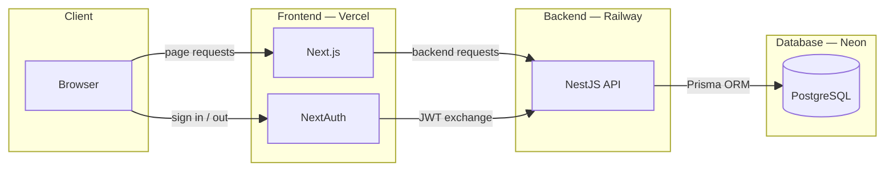
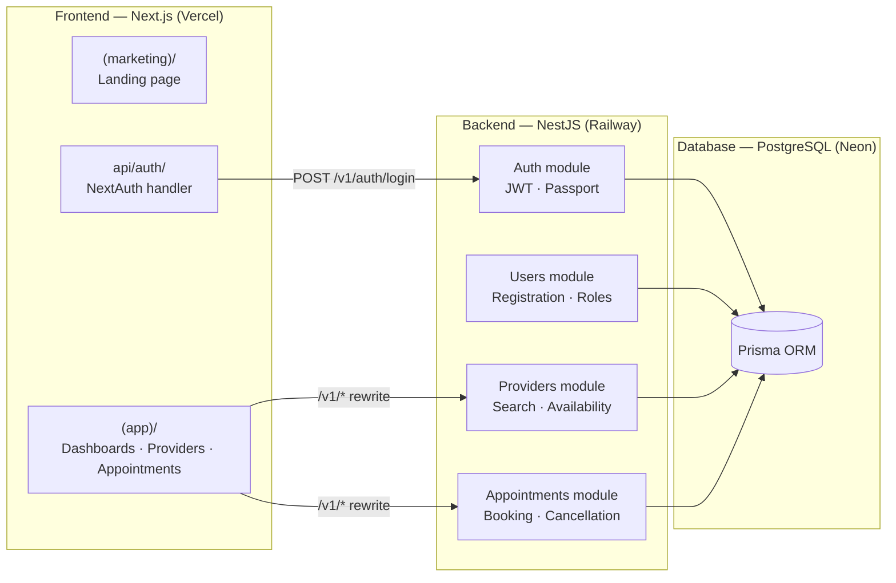

#  RhizoBook | Health Appointment Scheduler

RhizoBook is a full-stack **healthcare appointment scheduling platform**. Patients browse providers by specialty and location, book appointments, and manage their schedule. Providers view upcoming appointments and handle cancellations.

Architecturally, the project demonstrates a clean **domain-driven API design** with a decoupled frontend/backend deployment. The NestJS backend is organized into isolated domain modules (Auth → Users → Providers → Appointments), each owning its own controller, service, and Prisma query layer. The Next.js frontend uses route groups to separate public, authenticated, and auth-specific concerns, with all backend calls proxied through Next.js rewrites so internal infrastructure is never exposed to the client.

---



---

## 📋 Contents
- [🧰 Stack](#-stack)
- [🚀 Running the Project](#-running-the-project)
  - [✅ Prerequisites](#-prerequisites)
  - [⚡ Quick Start](#-quick-start)
  - [🔍 Exploring the API (Swagger UI)](#-exploring-the-api-swagger-ui)
  - [📦 npm Scripts](#-npm-scripts)
- [🏗️ Architecture](#️-architecture)
  - [🔀 Architecture Diagram](#-architecture-diagram)
  - [🗂️ Domain Modules](#️-domain-modules)
  - [🧩 TypeScript Patterns](#-typescript-patterns)
- [📸 Screenshots](#-screenshots)
- [📚 Docs](#-docs)
- [🗺️ Roadmap](#️-roadmap)
  - [📋 Planned](#-planned)
  - [📦 Implementation History](#-implementation-history)
    - [🔧 Core API \& Auth (Phases 1–3)](#-core-api--auth-phases-13)
    - [🖥️ Frontend \& Booking Flow (Phases 4–6)](#️-frontend--booking-flow-phases-46)
    - [🌐 Public \& Branding (Phases 7–8)](#-public--branding-phases-78)
    - [🔍 Search \& Discovery (Phases 9–11)](#-search--discovery-phases-911)


## 🧰 Stack

**🔐 Backend & Auth**

- **NestJS 11:** Module-per-domain architecture (`auth`, `users`, `providers`, `appointments`), each with its own controller → service → Prisma layer. `JwtAuthGuard` applied per-controller so public provider routes need no extra annotation.
- **Passport.js + JWT:** Stateless token auth issued by the backend. `JwtStrategy` validates tokens on every guarded request.
- **Prisma 5:** Type-safe ORM over PostgreSQL. All queries use explicit `select` to prevent accidental field exposure on public endpoints.
- **Swagger / OpenAPI:** Fully documented API with typed request/response schemas at [`/api`](https://api.rhizobook.cyberrhizome.ca/api).

**🖥️ Frontend**

- **Next.js 16 (App Router):** Route groups separate `(marketing)` (public landing), `(app)` (authenticated + shared nav), and auth pages. `useSearchParams` is always wrapped in `<Suspense>` for static generation compatibility.
- **NextAuth v4:** JWT session strategy. Auth handler lives in `app/api/auth/`. `signOut` uses `window.location.origin` as `callbackUrl` to stay port-agnostic.
- **Tailwind CSS + shadcn/ui:** Utility-first styling with accessible component primitives.
- **react-hook-form + Zod:** Typed form validation with shared schemas across client and server boundary.

**💾 Data**

- **PostgreSQL on [Neon](https://neon.tech):** Serverless PostgreSQL. `ProviderProfile` stores specialty, bio, city, and province. `AvailabilitySlot` drives the booking time-slot picker.
- **Two Axios instances:** `lib/api.ts` is an authenticated client (attaches JWT via interceptor); plain `axios.get('/v1/...')` handles unauthenticated public calls. All use relative `/v1/` paths, proxied by Next.js rewrites.

**🧪 Testing**

- **Jest (backend):** Controller tests mock the service layer; service tests use `mockPrismaService()` from `src/test-utils/prisma.mock.ts`.
- **Vitest + Testing Library (frontend):** Tests in `__tests__/`. Navigation, session, and axios calls are mocked per-file.


## 🚀 Running the Project

### ✅ Prerequisites

- **Node.js 20+** (NVM recommended — project uses Node 24)
- **PostgreSQL** — a [Neon](https://neon.tech) free-tier database works out of the box

> [!NOTE]
> Tested on **WSL2 (Ubuntu)**. Both services are deployed: backend on Railway, frontend on Vercel, database on Neon.

### ⚡ Quick Start

```bash
# 1. Clone and install
git clone <repo-url> && cd health-scheduler-ts

# Backend
cd backend
cp .env.example .env          # fill in DATABASE_URL, JWT_SECRET
npm install
npx prisma migrate dev
npx prisma db seed
npm run start:dev             # NestJS on :3001

# Frontend (separate terminal)
cd frontend
cp .env.local.example .env.local   # fill in BACKEND_URL, NEXTAUTH_URL, NEXTAUTH_SECRET
npm install
npm run dev                   # Next.js on :3000

# Open the app
open http://localhost:3000
# Swagger UI
open http://localhost:3001/api
```

### 🔍 Exploring the API (Swagger UI)

The live API documentation is at **[api.rhizobook.cyberrhizome.ca/api](https://api.rhizobook.cyberrhizome.ca/api)** — no local setup needed.

Every endpoint has pre-filled example payloads. Authenticated endpoints are marked with a 🔒 padlock. To unlock them:

> [!TIP]
> **All seed accounts share the password `password123`.**
>
> 1. Open **`POST /auth/login`** → click **Try it out** → pick **"Patient — Alice Smith"** from the example dropdown → **Execute**
> 2. Copy the `access_token` from the response body
> 3. Click **Authorize 🔓** at the top of the page → paste the token → **Authorize**
> 4. All 🔒 endpoints are now unlocked for the session

**Suggested walkthrough:**

| Step | Endpoint | What to see |
| --- | --- | --- |
| 1 | `POST /auth/login` | Receive a JWT and Alice's user/role object |
| 2 | `GET /appointments` | Alice's full appointment history (past + upcoming) |
| 3 | `GET /appointments/83` | Single appointment with nested provider + patient detail |
| 4 | `PATCH /appointments/109/cancel` | Cancel an appointment; response shows updated status |
| 5 | `GET /providers` | All 27 providers — **no auth required** |
| 6 | `GET /providers/options` | Distinct specialties, cities, and provinces for autocomplete |
| 7 | `GET /providers/1` | Sarah Johnson's full profile with availability slots |

To explore as a **provider**, log in as `sarah.johnson@clinic.com` (step 1 dropdown: *Provider — Sarah Johnson*) and repeat steps 2–4 to see her appointment view.

### 📦 npm Scripts

**Backend (`/backend`)**

| Script | Description |
| --- | --- |
| `npm run start:dev` | Watch mode dev server (port 3001) |
| `npm run start:prod` | Run compiled `dist/` |
| `npm run build` | Compile to `dist/` |
| `npm test` | Jest unit tests |
| `npm run test:cov` | Coverage report |
| `npm run lint` | ESLint with autofix |
| `./refresh-db.sh` | Hard reset DB and re-seed (recommended) |
| `npx prisma migrate dev` | Apply new migrations |
| `npx prisma db seed` | Re-seed sample data |
| `npx prisma generate` | Regenerate client after schema changes |
| `npx prisma studio` | Visual DB browser |

**Frontend (`/frontend`)**

| Script | Description |
| --- | --- |
| `npm run dev` | Dev server on port 3000 |
| `npm run build` | Production build |
| `npm run typecheck` | `tsc --noEmit` |
| `npm run lint` | ESLint |
| `npx vitest run` | Run all tests once |


## 🏗️ Architecture

### 🔀 Architecture Diagram



### 🗂️ Domain Modules

| Module | Key Files | Purpose |
| :--- | :--- | :--- |
| **🔐 Auth** | `src/auth/` | JWT issuance, Passport local + JWT strategies, `JwtAuthGuard` |
| **👤 Users** | `src/users/` | Registration, role lookup, `ProviderProfile` / `PatientProfile` creation |
| **🏥 Providers** | `src/providers/` | Provider listing with specialty / city / province filters, `GET /options` autocomplete endpoint, availability slots |
| **📅 Appointments** | `src/appointments/` | Time-slot picker, booking, status management, cancellation with reason |
| **🗄️ Prisma** | `src/prisma/` | Singleton `PrismaService`, shared `mockPrismaService()` test factory |

### 🧩 TypeScript Patterns

- Strict mode throughout — all nullable paths handled, no `!` non-null assertions
- Explicit `select` on every Prisma query — new schema columns are never accidentally exposed
- `z.infer<typeof Schema>` — no type duplication across validation and handler layers
- Two Axios instances — authenticated (`lib/api.ts`) and unauthenticated (plain `axios`) with a clear per-callsite contract
- `useSearchParams` always inside `<Suspense>` — enforced by Next.js static-generation constraints


## 📸 Screenshots

<table>
  <tr>
    <td align="center">
      <a href="https://github.com/user-attachments/assets/b5462d91-3bfb-4e65-9a63-619a87600f63"></a>
      <br /><sub>Provider listing</sub>
    </td>
    <td align="center">
      <a href="https://github.com/user-attachments/assets/3ef595fe-ac0d-4c42-8015-0b16eba506e0"></a>
      <br /><sub>Patient dashboard</sub>
    </td>
    <td align="center">
      <a href="https://github.com/user-attachments/assets/c2c4ed37-fa64-476f-9c69-e85e0f9fe532"></a>
      <br /><sub>Booking flow</sub>
    </td>
    <td align="center">
      <a href="https://github.com/user-attachments/assets/ca4288ab-b5dd-42c4-b3f6-5a72b0486580"></a>
      <br /><sub>Provider dashboard</sub>
    </td>
    <td align="center">
      <a href="https://github.com/user-attachments/assets/f7a95033-f9f3-456a-8f88-0775dd43ce1e"></a>
      <br /><sub>Appointment calendar</sub>
    </td>
  </tr>
</table>


## 📚 Docs

| File | Contents | Last updated |
| --- | --- | --- |
| [README.md](README.md) | Project overview | 2026-06-19 |
| [docs/ARCHITECTURE.md](docs/ARCHITECTURE.md) | System design, data model, module map, auth flow | 2026-05-29 |
| [docs/DEV_GETTING_STARTED.md](docs/DEV_GETTING_STARTED.md) | Full local setup walkthrough | 2026-05-01 |
| [docs/DEPLOYMENT.md](docs/DEPLOYMENT.md) | Railway + Vercel + Neon production deployment | 2026-04-30 |
| [docs/adr/](docs/adr/) | Architecture Decision Records | 2026-04-30 |
| [docs/SUGGESTED_IMPROVEMENTS.md](docs/SUGGESTED_IMPROVEMENTS.md) | Code quality audit — security, scheduling bugs, auth gaps, API design | 2026-02-25 |
| [LEARNING_LOG.md](LEARNING_LOG.md) | Engineering journal — one entry per phase | 2026-06-18 |
| [frontend/README.md](frontend/README.md) | Frontend-specific commands and structure | 2026-02-24 |


## 🗺️ Roadmap

### 📋 Planned

- [ ] **Google Calendar integration:** Send calendar invites to patients and providers on booking confirmation.
- [ ] **Email notifications:** Booking confirmation and appointment reminder emails.
- [ ] **Recurring availability schedules:** Let providers define weekly recurring slots rather than one-off entries.
- [ ] **Timezone handling:** Store and display availability in the provider's local timezone; convert on booking for the patient.
- [ ] **HIPAA compliance features:** Audit logging, data retention controls, and access-log visibility.
- [ ] **Personalized provider search:** For authenticated users, surface previously-booked providers at the top of autocomplete suggestions in the provider search fields.

### 📦 Implementation History

> [!NOTE]
> **11 Phases Completed** | Backend and frontend test suites passing

<details>
<summary>🔍 View phase-by-phase implementation history...</summary>

#### 🔧 Core API & Auth (Phases 1–3)

- **Phase 1 — Foundation:** NestJS project scaffold, Prisma schema and migrations, PostgreSQL on Neon, seed data with role-based user fixtures.
- **Phase 2 — Auth:** JWT issuance via `AuthService`, Passport local + JWT strategies, `JwtAuthGuard` applied per-controller. Role assignment on registration.
- **Phase 3 — Swagger / OpenAPI:** Full API documentation with typed request/response schemas, `@ApiTags`, `@ApiOperation`, and `@ApiResponse` decorators across all controllers.

#### 🖥️ Frontend & Booking Flow (Phases 4–6)

- **Phase 4 — Dashboards:** Patient and provider dashboards behind NextAuth session. Separate dashboard components per role; session-aware navigation.
- **Phase 5 — Booking Flow:** Time-slot picker generated from `AvailabilitySlot` records. Appointment creation guarded by JWT. `react-hook-form` + Zod validation throughout.
- **Phase 6 — Cancellation:** Appointment cancellation with optional reason field. Status-aware list filtering (`upcoming` / `cancelled` / `all`).

#### 🌐 Public & Branding (Phases 7–8)

- **Phase 7 — Landing Page + Branding:** Public `(marketing)` route group with provider/patient CTAs. Unified RhizoBook brand applied across authenticated and unauthenticated layouts. Logo, favicon, and colour palette.
- **Phase 8 — Seed Data Expansion:** Expanded seed with French Canadian names, multi-character sets, and a data-refresh script. Confirms the app handles non-ASCII provider names correctly.

#### 🔍 Search & Discovery (Phases 9–11)

- **Phase 9 — Unauthenticated Provider Search:** `GET /v1/providers` made public (no `JwtAuthGuard`). Explicit `select` replaces `include` to prevent sensitive field leakage (`email`, `licenseNumber`). Next.js rewrite proxy wired up so client uses `/v1/` relative paths.
- **Phase 10 — Calendar View:** `react-big-calendar` integrated on `/appointments` as a List / Calendar toggle. Events colour-coded by status. `dateFnsLocalizer` with `date-fns` for locale-aware date formatting.
- **Phase 11 — Location-Based Search + Autocomplete:** City and province filters added to `GET /v1/providers` (case-insensitive `contains`). New `GET /v1/providers/options` endpoint returns distinct specialties / cities / provinces for autocomplete. `SuggestionInput` component on the providers page populates dropdowns from those options. Active filters render as dismissible chips with a "Clear all" shortcut.

</details>
